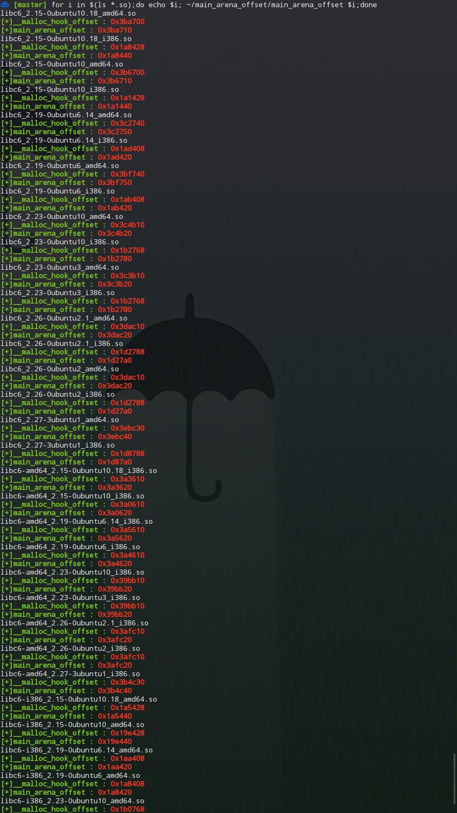

# main_arena_offset

> A simple shell script to get main_arena offset of a given libc

### install 
```bash
wget https://raw.githubusercontent.com/M4xW4n9/main_arena_offset/master/install.sh
chmod +x install.sh
sudo ./install.sh
```

### example
```bash
db [master] for i in $(ls *.so);do echo $i; ~/main_arena_offset/main_arena_offset $i;done
libc6_2.15-0ubuntu10.18_amd64.so
[+]__malloc_hook_offset : 0x3ba700
[+]main_arena_offset : 0x3ba710
libc6_2.15-0ubuntu10.18_i386.so
[+]__malloc_hook_offset : 0x1a8428
[+]main_arena_offset : 0x1a8440
libc6_2.15-0ubuntu10_amd64.so
[+]__malloc_hook_offset : 0x3b6700
[+]main_arena_offset : 0x3b6710
libc6_2.15-0ubuntu10_i386.so
[+]__malloc_hook_offset : 0x1a1428
[+]main_arena_offset : 0x1a1440
libc6_2.19-0ubuntu6.14_amd64.so
[+]__malloc_hook_offset : 0x3c2740
[+]main_arena_offset : 0x3c2750
libc6_2.19-0ubuntu6.14_i386.so
[+]__malloc_hook_offset : 0x1ad408
[+]main_arena_offset : 0x1ad420
libc6_2.19-0ubuntu6_amd64.so
[+]__malloc_hook_offset : 0x3bf740
[+]main_arena_offset : 0x3bf750
libc6_2.19-0ubuntu6_i386.so
[+]__malloc_hook_offset : 0x1ab408
[+]main_arena_offset : 0x1ab420
libc6_2.23-0ubuntu10_amd64.so
[+]__malloc_hook_offset : 0x3c4b10
[+]main_arena_offset : 0x3c4b20
libc6_2.23-0ubuntu10_i386.so
[+]__malloc_hook_offset : 0x1b2768
[+]main_arena_offset : 0x1b2780
libc6_2.23-0ubuntu3_amd64.so
[+]__malloc_hook_offset : 0x3c3b10
[+]main_arena_offset : 0x3c3b20
libc6_2.23-0ubuntu3_i386.so
[+]__malloc_hook_offset : 0x1b2768
[+]main_arena_offset : 0x1b2780
libc6_2.26-0ubuntu2.1_amd64.so
[+]__malloc_hook_offset : 0x3dac10
[+]main_arena_offset : 0x3dac20
libc6_2.26-0ubuntu2.1_i386.so
[+]__malloc_hook_offset : 0x1d2788
[+]main_arena_offset : 0x1d27a0
libc6_2.26-0ubuntu2_amd64.so
[+]__malloc_hook_offset : 0x3dac10
[+]main_arena_offset : 0x3dac20
libc6_2.26-0ubuntu2_i386.so
[+]__malloc_hook_offset : 0x1d2788
[+]main_arena_offset : 0x1d27a0
libc6_2.27-3ubuntu1_amd64.so
[+]__malloc_hook_offset : 0x3ebc30
[+]main_arena_offset : 0x3ebc40
libc6_2.27-3ubuntu1_i386.so
[+]__malloc_hook_offset : 0x1d8788
[+]main_arena_offset : 0x1d87a0
libc6-amd64_2.15-0ubuntu10.18_i386.so
[+]__malloc_hook_offset : 0x3a3610
[+]main_arena_offset : 0x3a3620
libc6-amd64_2.15-0ubuntu10_i386.so
[+]__malloc_hook_offset : 0x3a0610
[+]main_arena_offset : 0x3a0620
libc6-amd64_2.19-0ubuntu6.14_i386.so
[+]__malloc_hook_offset : 0x3a5610
[+]main_arena_offset : 0x3a5620
libc6-amd64_2.19-0ubuntu6_i386.so
[+]__malloc_hook_offset : 0x3a4610
[+]main_arena_offset : 0x3a4620
libc6-amd64_2.23-0ubuntu10_i386.so
[+]__malloc_hook_offset : 0x39bb10
[+]main_arena_offset : 0x39bb20
libc6-amd64_2.23-0ubuntu3_i386.so
[+]__malloc_hook_offset : 0x39bb10
[+]main_arena_offset : 0x39bb20
libc6-amd64_2.26-0ubuntu2.1_i386.so
[+]__malloc_hook_offset : 0x3afc10
[+]main_arena_offset : 0x3afc20
libc6-amd64_2.26-0ubuntu2_i386.so
[+]__malloc_hook_offset : 0x3afc10
[+]main_arena_offset : 0x3afc20
libc6-amd64_2.27-3ubuntu1_i386.so
[+]__malloc_hook_offset : 0x3b4c30
[+]main_arena_offset : 0x3b4c40
libc6-i386_2.15-0ubuntu10.18_amd64.so
[+]__malloc_hook_offset : 0x1a5428
[+]main_arena_offset : 0x1a5440
libc6-i386_2.15-0ubuntu10_amd64.so
[+]__malloc_hook_offset : 0x19e428
[+]main_arena_offset : 0x19e440
libc6-i386_2.19-0ubuntu6.14_amd64.so
[+]__malloc_hook_offset : 0x1aa408
[+]main_arena_offset : 0x1aa420
libc6-i386_2.19-0ubuntu6_amd64.so
[+]__malloc_hook_offset : 0x1a8408
[+]main_arena_offset : 0x1a8420
libc6-i386_2.23-0ubuntu10_amd64.so
[+]__malloc_hook_offset : 0x1b0768
[+]main_arena_offset : 0x1b0780
libc6-i386_2.23-0ubuntu3_amd64.so
[+]__malloc_hook_offset : 0x1af768
[+]main_arena_offset : 0x1af780
libc6-i386_2.26-0ubuntu2.1_amd64.so
[+]__malloc_hook_offset : 0x1cf788
[+]main_arena_offset : 0x1cf7a0
libc6-i386_2.26-0ubuntu2_amd64.so
[+]__malloc_hook_offset : 0x1cf788
[+]main_arena_offset : 0x1cf7a0
libc6-i386_2.27-3ubuntu1_amd64.so
[+]__malloc_hook_offset : 0x1d5788
[+]main_arena_offset : 0x1d57a0
```

### Screenshots



### Releases

- v0.1 -- I have tested libcs from [libc-database](https://github.com/niklasb/libc-database), but only 60% works. Version 0.1 must contains many many bugs and issues are welcomed.
- v0.2 -- I changed the method. Now it works on the equation **main_arena+0x10/0x18/0x20 == \__malloc\_hook**. It make a result for every libc from [libc-database](https://github.com/niklasb/libc-database). However, I haven't checked the result one by one, so a few results may be wrong and issues are welcomed, too.

### more

- You can set the color of output by modifying **main_arena_offset** as you want. I have preset some colors in **main_arena_offset**


### To-do list

- [ ] print helpful information(**main_arena -h**)
- [ ] check update(**main_arena -u**)
- [ ] set color easily(**main_arena -c**)
- [ ] test more libcs
