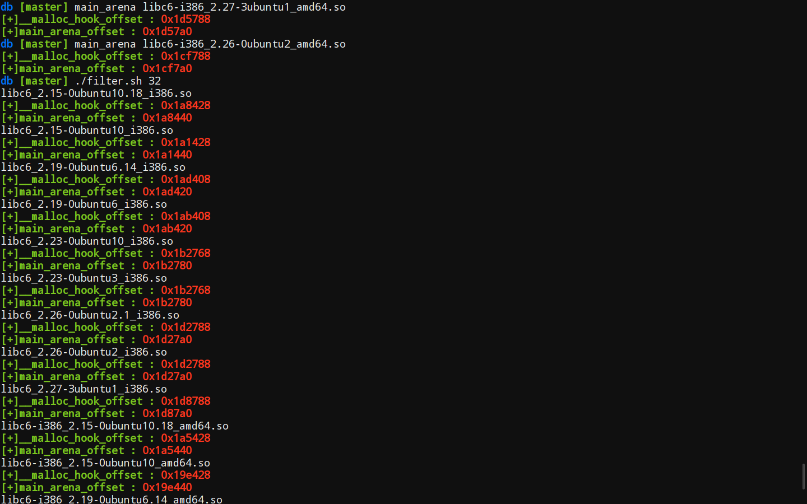
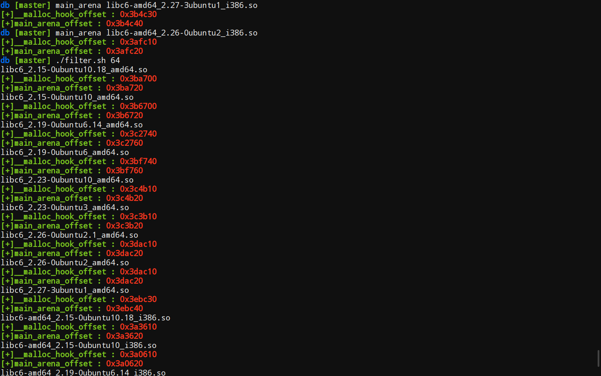

# main_arena_offset

> A simple shell script to get main\_arena offset of a given libc

<h3  id="1">install</h3>

```bash
$ wget -q -O- https://raw.githubusercontent.com/0x01f/main_arena_offset/master/install.sh| sh
```

### usage
```bash
$ main_arena your_libc
```

### example
```bash
db [master] cat filter.sh
#!/usr/bin/env bash
# set -euxo pipefail

for i in $(ls *.so)
do
	# echo $i
	info=$(file $i)
	# echo $info
	if [[ "$info" =~ "$1""-bit" ]]
	then
		echo $i
		main_arena $i
	fi
done

db [master] ./filter.sh 32
libc6_2.15-0ubuntu10.18_i386.so
[+]__malloc_hook_offset : 0x1a8428
[+]main_arena_offset : 0x1a8440
libc6_2.15-0ubuntu10_i386.so
[+]__malloc_hook_offset : 0x1a1428
[+]main_arena_offset : 0x1a1440
libc6_2.19-0ubuntu6.14_i386.so
[+]__malloc_hook_offset : 0x1ad408
[+]main_arena_offset : 0x1ad420
libc6_2.19-0ubuntu6_i386.so
[+]__malloc_hook_offset : 0x1ab408
[+]main_arena_offset : 0x1ab420
libc6_2.23-0ubuntu10_i386.so
[+]__malloc_hook_offset : 0x1b2768
[+]main_arena_offset : 0x1b2780
libc6_2.23-0ubuntu3_i386.so
[+]__malloc_hook_offset : 0x1b2768
[+]main_arena_offset : 0x1b2780
libc6_2.26-0ubuntu2.1_i386.so
[+]__malloc_hook_offset : 0x1d2788
[+]main_arena_offset : 0x1d27a0
libc6_2.26-0ubuntu2_i386.so
[+]__malloc_hook_offset : 0x1d2788
[+]main_arena_offset : 0x1d27a0
libc6_2.27-3ubuntu1_i386.so
[+]__malloc_hook_offset : 0x1d8788
[+]main_arena_offset : 0x1d87a0
libc6-i386_2.15-0ubuntu10.18_amd64.so
[+]__malloc_hook_offset : 0x1a5428
[+]main_arena_offset : 0x1a5440
libc6-i386_2.15-0ubuntu10_amd64.so
[+]__malloc_hook_offset : 0x19e428
[+]main_arena_offset : 0x19e440
libc6-i386_2.19-0ubuntu6.14_amd64.so
[+]__malloc_hook_offset : 0x1aa408
[+]main_arena_offset : 0x1aa420
libc6-i386_2.19-0ubuntu6_amd64.so
[+]__malloc_hook_offset : 0x1a8408
[+]main_arena_offset : 0x1a8420
libc6-i386_2.23-0ubuntu10_amd64.so
[+]__malloc_hook_offset : 0x1b0768
[+]main_arena_offset : 0x1b0780
libc6-i386_2.23-0ubuntu3_amd64.so
[+]__malloc_hook_offset : 0x1af768
[+]main_arena_offset : 0x1af780
libc6-i386_2.26-0ubuntu2.1_amd64.so
[+]__malloc_hook_offset : 0x1cf788
[+]main_arena_offset : 0x1cf7a0
libc6-i386_2.26-0ubuntu2_amd64.so
[+]__malloc_hook_offset : 0x1cf788
[+]main_arena_offset : 0x1cf7a0
libc6-i386_2.27-3ubuntu1_amd64.so
[+]__malloc_hook_offset : 0x1d5788
[+]main_arena_offset : 0x1d57a0
db [master] ./filter.sh 64
libc6_2.15-0ubuntu10.18_amd64.so
[+]__malloc_hook_offset : 0x3ba700
[+]main_arena_offset : 0x3ba720
libc6_2.15-0ubuntu10_amd64.so
[+]__malloc_hook_offset : 0x3b6700
[+]main_arena_offset : 0x3b6720
libc6_2.19-0ubuntu6.14_amd64.so
[+]__malloc_hook_offset : 0x3c2740
[+]main_arena_offset : 0x3c2760
libc6_2.19-0ubuntu6_amd64.so
[+]__malloc_hook_offset : 0x3bf740
[+]main_arena_offset : 0x3bf760
libc6_2.23-0ubuntu10_amd64.so
[+]__malloc_hook_offset : 0x3c4b10
[+]main_arena_offset : 0x3c4b20
libc6_2.23-0ubuntu3_amd64.so
[+]__malloc_hook_offset : 0x3c3b10
[+]main_arena_offset : 0x3c3b20
libc6_2.26-0ubuntu2.1_amd64.so
[+]__malloc_hook_offset : 0x3dac10
[+]main_arena_offset : 0x3dac20
libc6_2.26-0ubuntu2_amd64.so
[+]__malloc_hook_offset : 0x3dac10
[+]main_arena_offset : 0x3dac20
libc6_2.27-3ubuntu1_amd64.so
[+]__malloc_hook_offset : 0x3ebc30
[+]main_arena_offset : 0x3ebc40
libc6-amd64_2.15-0ubuntu10.18_i386.so
[+]__malloc_hook_offset : 0x3a3610
[+]main_arena_offset : 0x3a3620
libc6-amd64_2.15-0ubuntu10_i386.so
[+]__malloc_hook_offset : 0x3a0610
[+]main_arena_offset : 0x3a0620
libc6-amd64_2.19-0ubuntu6.14_i386.so
[+]__malloc_hook_offset : 0x3a5610
[+]main_arena_offset : 0x3a5620
libc6-amd64_2.19-0ubuntu6_i386.so
[+]__malloc_hook_offset : 0x3a4610
[+]main_arena_offset : 0x3a4620
libc6-amd64_2.23-0ubuntu10_i386.so
[+]__malloc_hook_offset : 0x39bb10
[+]main_arena_offset : 0x39bb20
libc6-amd64_2.23-0ubuntu3_i386.so
[+]__malloc_hook_offset : 0x39bb10
[+]main_arena_offset : 0x39bb20
libc6-amd64_2.26-0ubuntu2.1_i386.so
[+]__malloc_hook_offset : 0x3afc10
[+]main_arena_offset : 0x3afc20
libc6-amd64_2.26-0ubuntu2_i386.so
[+]__malloc_hook_offset : 0x3afc10
[+]main_arena_offset : 0x3afc20
libc6-amd64_2.27-3ubuntu1_i386.so
[+]__malloc_hook_offset : 0x3b4c30
[+]main_arena_offset : 0x3b4c40
```

### Screenshots




### Releases

#### Alpha

- v0.1 -- I have tested libcs from [libc-database](https://github.com/niklasb/libc-database), but only 60% works. Version 0.1 must contains many many bugs and issues are welcome.
- v0.2 -- I changed the method. Now it works on the equation **main_arena+0x10/0x18/0x20 == \__malloc\_hook**. It make a result for every libc from [libc-database](https://github.com/niklasb/libc-database). However, I haven't checked the result one by one, so a few results may be wrong and issues are welcome, too.
- v0.3 -- The setup procedure has been simplified a lot and now you can install this tool using a simple  <a href="#1" target="_self">command</a>.
- v0.4 -- It's able to print libc-version-information now.

#### Beta
- v0.5 -- Many changes. I modified the shell-script a lot and it work's better. Most importantly, I have tested all the libcs from [libc-databases](https://github.com/niklasb/libc-database) and all of them made it! So I decided to release Beta-v0.5.

- v0.6 -- fix a small bug.

#### Alpha
- v1.0 -- I give it up to add more optitions(To-do list) cause it's not important lol.

### more
- Though it works perfect on [libc-databases](https://github.com/niklasb/libc-database) now(*Alpha-v0.5*). But I'm not sure whether it works well on other libcs so issues are welcome.


~~### To-do list~~

~~- [ ] print helpful information(**main_arena -h**)~~

~~- [ ] check update(**main_arena -u**)~~

~~- [ ] set color easily(**main_arena -c**)~~

~~- [ ] more package manager system support(yum, pacman etc)~~

~~- [ ] test more libcs~~

### Make main\_arena\_offset better
Any suggestion or feature request is welcome! Feel free to send a pull request.
Please let me know if you find any libc that makes main\_arena\_offset fail to find right address. And, if you like this work, I'll be happy to be starred 
